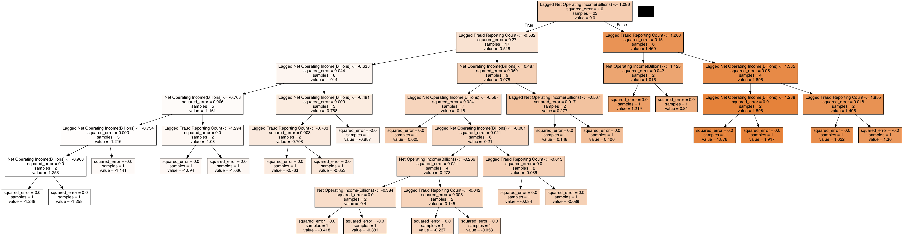
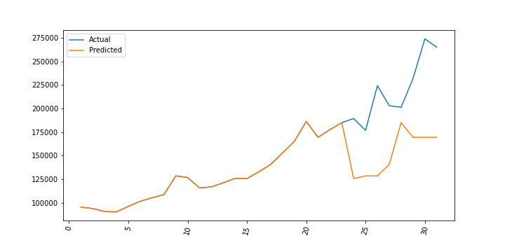
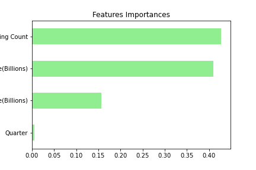
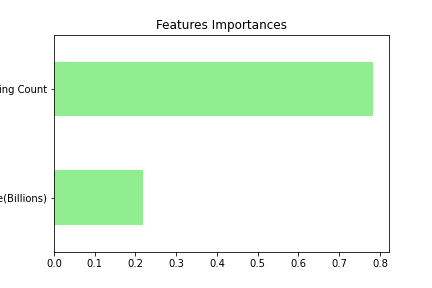
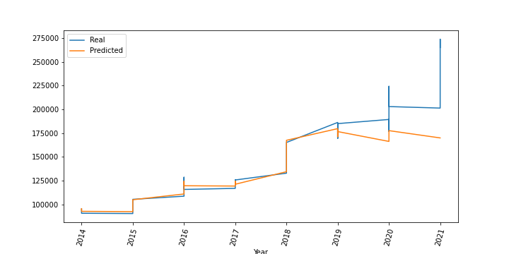
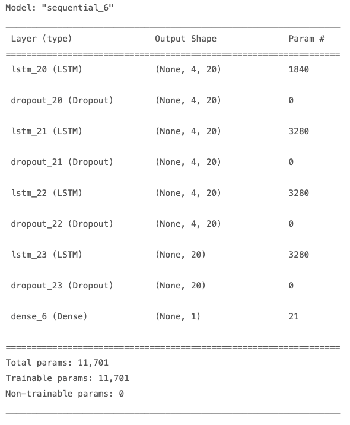
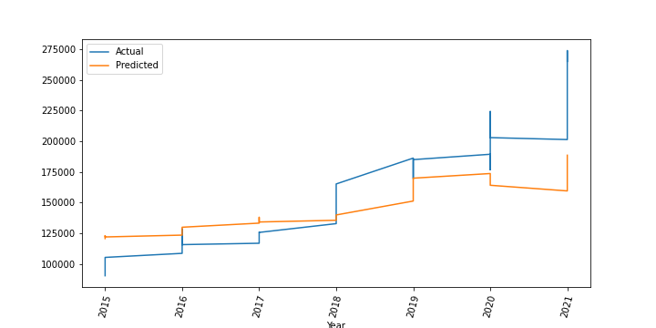
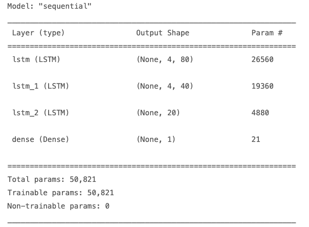
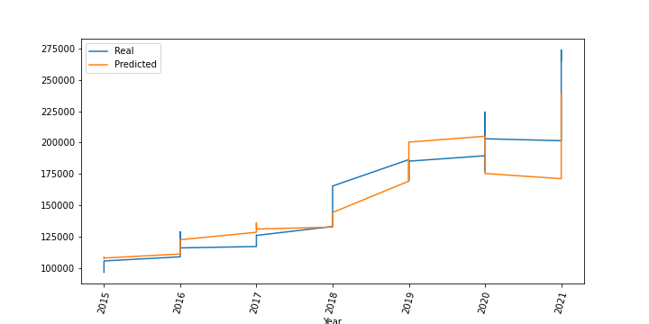

# Project2

## Data: SARS and FDIC Quarterly Banking Profile 
    - SARS for Depository Institutions 2014-2021: [Resources/SARStats2014_2021.csv](Resources/SARStats2014_2021.csv)  
    - FDIC Quarterly Banking Profiles: [Resources/FDICQBPs.csv](Resources/FDICQBPs.csv) 
Data cleaning process: [data.ipynb](data.ipynb)
## Overview
Using the data we gathered, we wanted to see if we can create a predictive model to predict the next quarter's Depository Institution fraud reporting number based on the Net Operating Income from FDIC Quarterly Banking Profiles. We decided to do 4 different models, **Decision Tree, Random Forest and 2 Deep learning models**

## Code
[Decision Tree](decision_tree_H.ipynb) 
[Random Forest](random_forest.ipynb) 
[LSTM RNN Model 1](deep_tensorflow_wj.ipynb) 
[LSTM RNN Model 2](deep_learning_as.ipynb) 

## Outputs
### Decision Tree
Using a decision tree model, we were able to create the following tree:

**The R squared score we got with this model was: 0.656673881135426** 
**Resulting Plot:** 

### Random Forest 
Using Random Forest, we tried first with all the features and got the following feature importances:  
 
However the R2 score was pretty low, so we took out some features and ended up with 
 
**The R squared score we got with this model was: 0.6367452319814639** 
**Resulting Plot:** 
 

### LSTM RNN Model 1
Summary of Model 1: 
 
**The R squared score we got with this model was: 0.56** 
**Resulting Plot:** 
 

### LSTM RNN Model 2 
Summary of Model 2: 
 
**The R squared score we got with this model was: 0.839697950645499** 
**Resulting Plot:** 
 
